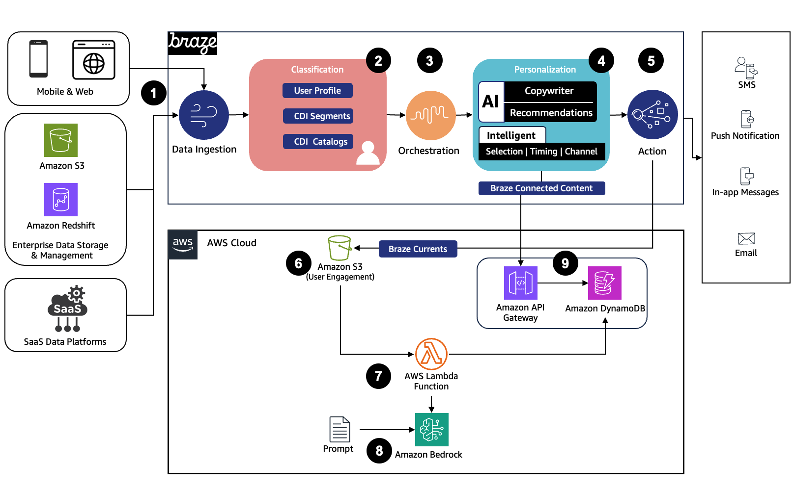

# Hyper-Personalized Customer Experience Powered by Braze and AWS CDK Project

This sample AWS CDK project demonstrates how Braze, a leading customer engagement platform and Amazon Bedrock helps brands forge human connections with customers through real-time hyper-personalization to drive higher revenues and increased retention rates.
<br>Please note that this sample code is for **demonstration and experimentation purposes only**.

## Architecture Overview



## Data Flow

1. Braze collects user events, attributes, and catalog items from various touch points like Web, App, and SaaS platforms using SDKs and API native integrations. Also, Braze Cloud Data Ingest allows brands to integrate data directly from their data warehouse or data lake such as Amazon Redshift and Amazon S3.
2. Braze classification layer dynamically classify and build user profiles, segments and catalog based on data passing through the platform.
3. Braze orchestration layer allows to design user journeys based on user data and prior engagement.
4. Braze personalization layer represents the ability to deliver dynamic content in your messages. Using AI copywriter and recommendation, Braze offers the capability to generate AI-powered dynamic content. Moreover, Braze Intelligence Suite automate decision-making to deliver the right content, to the right channel at the right time.
5. Braze action layer enables your actual messaging to users via several channels such as SMS, push notification, and email.
6. Braze Currents stream users engagement data to Amazon S3.
7. This triggers AWS Lambda function to run a inference using Amazon Bedrock.
8. Amazon Bedrock generates AI personalized content powered by customized prompt and returns the generated content to the AWS Lambda function.
9. AWS Lambda function stores the generates AI personalized content in Amazon DynamoDB table. Then, Braze Connected Content can access the AI personalized content stored in Amazon DynamoDB via Amazon API Gateway and render it directly into messages sent to users.

## Important Disclaimer

⚠️ **This code is for demonstration and experimentation purposes only!**

⚠️ **This project is deployed and tested in "us-east-1" region**

⚠️ **This project deploy only the AWS infrastructure detailed in the above architecture**

## Setup and Configuration

The `cdk.json` file tells the CDK Toolkit how to execute your app.

This project is set up like a standard Python project. The initialization
process also creates a virtualenv within this project, stored under the `.venv`
directory.

To install the required dependencies:

```
$ pip install -r requirements.txt
```

At this point you can now synthesize the CloudFormation template for this code.

```
$ cdk synth
```

To add additional dependencies, for example other CDK libraries, just add
them to your `setup.py` file and rerun the `pip install -r requirements.txt`
command.

## Braze Setup and Configuration

### Currents

[Currents](https://www.braze.com/docs/user_guide/data/braze_currents#how-to-access-currents) for S3 is a continuous stream of engagement data from Braze to an S3 storage bucket. Currents writes Avro files to your storage bucket at regular thresholds.

#### Step 1: Set up your Current

To get started, go to Partner Integrations > Data Export. You’ll be taken to the Currents integration management page. Use the “Create New Current” dropdown to select “Amazon S3 Data Export”

#### Step 2: Configure the Credentials

Follow the [instructions in this doc](https://www.braze.com/docs/partners/data_and_infrastructure_agility/cloud_storage/amazon_s3#prerequisites) to input the relevant credentials based on your desired authentication method.

#### Step 3: Configure your Events

Choose the events you wish to pass to that partner by checking from the available options. You can find listings of these events in our [Customer Behavior Events](https://www.braze.com/docs/user_guide/data/braze_currents/event_glossary/customer_behavior_events) and [Message Engagement Events](https://www.braze.com/docs/user_guide/data/braze_currents/event_glossary/message_engagement_events) libraries.

#### Step 4: Click Launch Current

### Build Your Connected Content Snippet

[Braze Connected Content](https://www.braze.com/docs/user_guide/personalization_and_dynamic_content/connected_content) allows you to insert any information accessible via API directly into messages you send to users. Braze makes a GET request at send time to the endpoint specified within the connected_content tag. The returned JSON can be parsed and used within the email message.

#### Step 1: Compose your Connected Content Request

1. Pass your AWS endpoint into the Connected Content Liquid tag.
2. Use Liquid to pass in the identifier you would like to use. In this demo we are using `{{${braze_id}}}`
3. Specify `:save your_variable_name` after the URL to save the data as a local variable.

The end result should look something like this:

``

The return payload will be something like this:

```json
{
  "Item": {
    "data": {
      "M": {
        "emailTitle": {
          "S": "A new episode of Redemption Point is now streaming!"
        },
        "heading": {
          "S": "Don't miss episode 2 of Redemption Point"
        },
        "details": {
          "M": {
            "cta": {
              "S": "Stream episode 2 now and unravel the mystery! Binge the entire season of this gripping sci-fi series today."
            },
            "intro": {
              "S": "We know you love the intense action of Redemption Point. Get ready for more twists and turns as episode 2 is now available to stream!"
            },
            "episodeDetails": {
              "S": "In this episode, memory detective Anna Chase investigates a new set of murders with links to the MemTech corporation. With the help of her team, she uncovers clues about the killer's implanted memories and how MemTech may be involved."
            }
          }
        }
      }
    },
    "user_id": {
      "S": "00000000000000000"
    }
  }
}
```

#### Step 2: Create the Liquid Snippet for use in the email campaign

Use [Liquid dot notation to parse](https://www.braze.com/docs/user_guide/personalization_and_dynamic_content/connected_content/local_connected_content_variables#json-parsing) and reference the heading, intro and episode details within the returned payload. These snippets will be used within the respective parts of the email campaign.

The snippets we will be using in our email campaign are:

`{{result.Item.data.M.heading.S}}`

`{{result.Item.data.M.details.M.intro.S}}`

`{{result.Item.data.M.details.M.episode_details.S}}`

### Create your Email Campaign

[Campaigns](https://www.braze.com/docs/user_guide/message_building_by_channel/email/html_editor/creating_an_email_campaign#step-1-choose-where-to-build-your-message) are a single message step to connect to your users on channels such as Email.

#### Step 1: Build Your Campaign

1. Go to Messaging > Campaigns and select Create Campaign.
2. Select Email
3. Name your campaign something clear and meaningful.
4. Select your desired editing experience: Drag-and-Drop, HTML code editor or Templates

### Step 2: Compose Your Email

Use Braze’s email composer to add the Connected Content call and parsed Liquid Snippets into the relevant parts of your email.


You can preview what will be returned for a specific user by going to preview & test in the sidebar and searching for a user who will be included within the email audience


### Step 3: Build the Remainder of Your Campaign and Launch

See the [following Braze documentation](https://www.braze.com/docs/user_guide/message_building_by_channel/email/html_editor/creating_an_email_campaign/#step-4-build-the-remainder-of-your-campaign-or-canvas) for further details on how to best use our tools to build your email campaign.

## Useful commands

- `cdk ls` list all stacks in the app
- `cdk synth` emits the synthesized CloudFormation template
- `cdk deploy` deploy this stack to your default AWS account/region
- `cdk diff` compare deployed stack with current state
- `cdk docs` open CDK documentation

## Security

See [CONTRIBUTING](CONTRIBUTING.md#security-issue-notifications) for more information.

## License

This library is licensed under the MIT-0 License. See the LICENSE file.

Enjoy!
